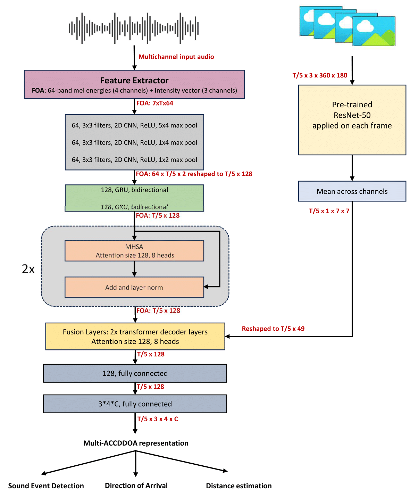

# DCASE 2024: Sound Event Localization and Detection (SELD) Evaluated in Real Spatial Sound Scenes

[Please visit the official webpage of the DCASE 2024 Challenge for details missing in this repo](https://dcase.community/challenge2024/task-audio-and-audiovisual-sound-event-localization-and-detection-with-source-distance-estimation).
   
As the baseline method for the SELD task, we use the SELDnet method studied in the following papers, with  Multiple Activity-Coupled Cartesian Distance and Direction of Arrival (Multi-ACCDDOA) representation as the output format. Specifically for the microphone version of the dataset, we have added support for the SALSA-lite features. If you are using this baseline method or the datasets in any format, then please consider citing the following papers. If you want to read more about [generic approaches to SELD then check here](https://www.aane.in/research/computational-audio-scene-analysis-casa/sound-event-localization-detection-and-tracking).


1. [Sharath Adavanne, Archontis Politis, Joonas Nikunen and Tuomas Virtanen, "Sound event localization and detection of overlapping sources using convolutional recurrent neural network" in IEEE Journal of Selected Topics in Signal Processing (JSTSP 2018)](https://arxiv.org/pdf/1807.00129.pdf)
2. [Kazuki Shimada, Yuichiro Koyama, Shusuke Takahashi, Naoya Takahashi, Emiru Tsunoo, and Yuki Mitsufuji, " Multi-ACCDOA: localizing and detecting overlapping sounds from the same class with auxiliary duplicating permutation invariant training" in The International Conference on Acoustics, Speech, & Signal Processing (ICASSP 2022)](https://arxiv.org/pdf/2110.07124.pdf)
3. [Thi Ngoc Tho Nguyen, Douglas L. Jones, Karn N. Watcharasupat, Huy Phan, and Woon-Seng Gan, "SALSA-Lite: A fast and effective feature for polyphonic sound event localization and detection with microphone arrays" in the International Conference on Acoustics, Speech, & Signal Processing (ICASSP 2022)](https://arxiv.org/pdf/2111.08192.pdf)
4. [Parthasaarathy Sudarsanam, Archontis Politis, Konstantinos Drossos, "Assessment of Self-Attention on Learned Features For Sound Event Localization and Detection" in Proceedings of the 6th Detection and Classification of Acoustic Scenes and Events 2021 Workshop (DCASE2021)](https://dcase.community/documents/workshop2021/proceedings/DCASE2021Workshop_Sudarsanam_38.pdf)
5. [Davide Berghi, Peipei Wu, Jinzheng Zhao, Wenwu Wang, Philip J. B. Jackson, "Fusion of audio and audiovisual embeddings for sound event localization and detection" in the International Conference on Acoustics, Speech, & Signal Processing (ICASSP 2024)](https://arxiv.org/pdf/2312.09034.pdf)
6. [Daniel Aleksander Krause, Archontis Politis, Annamaria Mesaros, "Sound Event Detection and Localization with Distance Estimation" in arXiv: 2403.11827](https://arxiv.org/abs/2403.11827)

## BASELINE METHOD

For the audio baseline, we modify the SELDnet studied in [1]. We have introduced multi-head self-attention blocks in the SELDnet architecture based on our findings in [4]. For the output format, to support the detection of multiple instances of the same class overlapping and include distance estimation we switch to the Multi-ACCDDOA [2,6]. Additionally, we use SALSA-lite [3] features for the microphone version of the dataset, this is to overcome the poor performance of GCC features in the presence of multiple overlapping sound events.

For the audio-visual baseline, inspired by the work in [5], we extract ResNet-50 features for the video frames corresponding to the input audio. The frame rate is set to 10fps. The visual features are fused with the audio features using transformer decoder blocks. The output of the transformer block is fed to linear layers for obtaining the Multi-ACCDDOA representation.

The final SELDnet architecture is shown below. The input is the multichannel audio and their corresponding video frames from which acoustic and ResNet-50 features are extracted respectively. The model predicts all the active sound event classes for each frame along with their respective spatial location, producing the temporal activity and DOA trajectory for each sound event class. Each sound event class in the Multi-ACCDDOA output is represented by four regressors that estimate the Cartesian coordinates x, y, and z axes of the DOA around the microphone and a distance value. If the vector length represented by x, y, and z coordinates is greater than 0.5, the sound event is considered active, and the corresponding x, y, and z values are considered its predicted DOA.

<p align="center">
   
</p>

## DATASETS

Similar to previous editions of the challenge, the participants can choose either or both the versions or the datasets,

 * **Sony-TAu Realistic Spatial Soundscapes 2023 (STARSS23) - Ambisonic**
 * **Sony-TAu Realistic Spatial Soundscapes 2023 (STARSS23) - Microphone Array**

These datasets contain recordings from an identical scene, with **Ambisonic** version providing four-channel First-Order Ambisonic (FOA) recordings while  **Microphone Array** version provides four-channel directional microphone recordings from a tetrahedral array configuration. Both the datasets, consists of a development and evaluation set. All participants are expected to use the fixed splits provided in the baseline method for reporting the development scores. The evaluation set will be released at a later point.

More details on the recording procedure and dataset can be read on the [DCASE 2023 task webpage](https://dcase.community/challenge2023/task-sound-event-localization-and-detection-evaluated-in-real-spatial-sound-scenes#Dataset).

The development dataset can be downloaded from the link - [**Sony-TAu Realistic Spatial Soundscapes 2023 (STARSS23)**](https://doi.org/10.5281/zenodo.7709052) [](https://doi.org/10.5281/zenodo.7709052)

The baseline method presented here is trained on the development set recordings. The audio feature extraction layers are initialized with the weights in `3_1_dev_split0_multiaccdoa_foa_model.h5`. These weights are obtained by training the audio model on a synthetic dataset. 
More details about the synthetic dataset used here can be found in the [DCASE 2022 task webpage](https://dcase.community/challenge2022/task-sound-event-localization-and-detection-evaluated-in-real-spatial-sound-scenes#example-external-data-use-with-baseline) 


## Getting Started

This repository consists of multiple Python scripts forming one big architecture used to train the SELDnet.
* The `batch_feature_extraction.py` is a standalone wrapper script, that extracts the features, labels, and normalizes the training and test split features for a given dataset. Make sure you update the location of the downloaded datasets before.
* The `parameter.py` script consists of all the training, model, and feature parameters. If a user has to change some parameters, they have to create a sub-task with unique id here. Check code for examples.
* The `cls_feature_class.py` script has routines for labels creation, features extraction and normalization.
* The `cls_vid_features.py` script extracts video features for the audio-visual task from a pretrained ResNet model.
* The `cls_data_generator.py` script provides feature + label data in generator mode for training.
* The `seldnet_model.py` script implements the SELDnet architecture.
* The `SELD_evaluation_metrics.py` script implements the metrics for joint evaluation of detection and localization.
* The `train_seldnet.py` is a wrapper script that trains the SELDnet. The training stops when the SELD error (check paper) stops improving.
* The `cls_compute_seld_results.py` script computes the metrics results on your DCASE output format files. 

### Prerequisites

The provided codebase has been tested on python 3.8.11 and torch 2.2.1


### Training the SELDnet

To quickly train SELDnet follow the steps below.

* For the chosen dataset (Ambisonic or Microphone), download the respective zip file. This contains both the audio files and the respective metadata. Also, download the development video zip file to use the audiovisual model.
* Unzip the files under the same 'DCASE2024_SELD_dataset/', ie., if you are using the Ambisonic dataset along with the videos, then the 'DCASE2024_SELD_dataset/' should have three folders - 'foa_dev/', 'metadata_dev/', and 'video_dev/' after unzipping.
  
* Now update the respective dataset name and its path in the `parameter.py` script. For the above example, you will change `dataset='foa'` and `dataset_dir='DCASE2024_SELD_dataset/'`. Also, provide a directory path `feat_label_dir` in the same `parameter.py` script where all the features and labels will be dumped.
  
* To run the audio visual baseline, change  `modality = "audio_visual" ` in the `parameter.py` script.

* Extract features from the downloaded dataset by running the `batch_feature_extraction.py` script. Run the script as shown below. This will dump the normalized features and labels in the `feat_label_dir` folder. The Python script allows you to compute all possible features and labels. You can control this by editing the `parameter.py` script before running the `batch_feature_extraction.py` script.

*  For the baseline, You can compute the default parameters for the FOA version of the dataset with Multi-ACCDOA labels using the command below. Check the code to see how it is implemented.

```
python3 batch_feature_extraction.py 3
```

* Finally, you can now train the SELDnet with the default parameters using `train_seldnet.py`. Additionally, you can add/change parameters by using a unique identifier \<task-id\> in the if-else conditions as seen in the `parameter.py` script and call them as follows. Where \<job-id\> is a unique identifier that is used for output filenames (models, training plots). You can use any number or string for this.

```
python3 train_seldnet.py <task-id> <job-id>
```

* To get baseline results for the Ambisonic format, run the following command
```
python3 train_seldnet.py 3
```

## Results on development dataset

As the [SELD evaluation metric](https://www.aane.in/research/computational-audio-scene-analysis-casa/sound-event-localization-detection-and-tracking#h.ragsbsp7ujs) we employ the joint localization and detection metrics proposed in [1], with extensions from [2, 6] to support multi-instance scoring of the same class and distance estimation.

1. [Annamaria Mesaros, Sharath Adavanne, Archontis Politis, Toni Heittola, and Tuomas Virtanen, "Joint Measurement of Localization and Detection of Sound Events", IEEE Workshop on Applications of Signal Processing to Audio and Acoustics (WASPAA 2019)](https://ieeexplore.ieee.org/document/8937220)

2. [Archontis Politis, Annamaria Mesaros, Sharath Adavanne, Toni Heittola, and Tuomas Virtanen, "Overview and Evaluation of Sound Event Localization and Detection in DCASE 2019", IEEE/ACM Transactions on Audio, Speech, and Language Processing (TASLP 2020)](https://arxiv.org/pdf/2009.02792.pdf)

This year, we have simplified the metrics and we are using only F-score (F<sub>20°</sub>), DOA angular error (DOAE<sub>CD</sub>), and relative distance error (RDE<sub>CD</sub>) computed at frame level (instead of computing them in one-second non-overlapping segments as done in previous years.
The F-score (F<sub>20°</sub>) is more focused on the detection part, but we consider the prediction to be correct only if the prediction and reference class are the same, the DOA angular error is below 20&deg;, and the relative distance error is bellow 1.0.
The next two metrics are more focused on the localization part, also referred as the class-aware localization, corresponding to the angular error (DOAE<sub>CD</sub>) in degrees, and a relative distance error (RDE<sub>CD</sub>), where the subscript refers to _classification-dependent_. The relative distance error is defined as the difference between the estimated and the reference distances divided by the reference distance. Unlike the location-aware detection, we do not use any angular or distance thresholds.

As in the previous challenge, this year we use the macro mode of computation. We first compute the above four metrics for each of the sound classes and then average them to get the final system performance.

The evaluation metric scores for the test split of the development dataset is given below. 

| Dataset | F<sub>20°</sub> | DOAE<sub>CD</sub> | RDE<sub>CD</sub> |
| ----| --- | --- | --- |
| Audio - Ambisonic (FOA + Multi-ACCDOA) | 13.1% | 36.9&deg; | 0.33 |
| Audio-visual - Ambisonic (FOA + Multi-ACCDOA) | 11.3% | 38.4&deg; | 0.36 |
| Audio - (MIC-GCC + Multi-ACCDOA) | 9.9% | 38.1&deg; | 0.30 |
| Audio-visual - (MIC-GCC + Multi-ACCDOA) | 11.8% | 38.5&deg; | 0.29 |

**Note:** The reported baseline system performance is not exactly reproducible due to varying setups. However, you should be able to obtain very similar results.

## Submission

* Make sure the file-wise output you are submitting is produced at 100 ms hop length. At this hop length a 60 s audio file has 600 frames.

For more information on the submission file formats [check the website](https://dcase.community/challenge2024/task-sound-event-localization-and-detection-evaluated-in-real-spatial-sound-scenes#submission)

## License

This repo and its contents have the MIT License.
